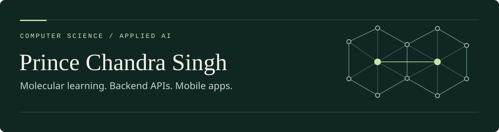

  

  <a href="https://princechandrasinghportfolio.netlify.app">Portfolio</a> &nbsp; · &nbsp;
  <a href="https://www.linkedin.com/in/princechandrasingh/">LinkedIn</a> &nbsp; · &nbsp;
  <a href="https://github.com/princechandrasingh?tab=repositories">Projects</a>

I'm **Prince Chandra Singh**, a Computer Science student building machine learning experiments, backend APIs, and mobile applications. I enjoy turning a problem into working software, then making the code, evaluation, and documentation easier to understand.

My current focus is **Molevanta: Drug Discovery with Deep Learning and Molecular Ensembles**, a computational research project exploring antibacterial activity prediction. It combines molecular fingerprints, graph neural networks, and ensembles, with reproducible experiments and evaluation on molecules with unfamiliar core structures. The repository includes the methods, results, and limitations of the study.

My other work spans Django REST APIs, smartphone activity recognition, and React Native apps. I'm also exploring agentic AI through learning notebooks on tool calling, LangGraph workflows, and retrieval-augmented generation with LlamaIndex.

### 👨‍💻 Project Contributions

<!-- Keep project descriptions grounded in the linked repositories. -->

| Project | Focus | Tech Stack |
| --- | --- | --- |
| **[Molevanta: Drug Discovery with Deep Learning and Molecular Ensembles](https://github.com/princechandrasingh/molevanta-drug-discovery-with-deep-learning-and-molecular-ensembles)** | Computational antibacterial screening; molecular generalization, model comparisons, and reproducible evaluation | Python, PyTorch, RDKit, scikit-learn, Chemprop |
| **[Employee Management API](https://github.com/princechandrasingh/employee_project)** | Employee, attendance, and performance APIs with JWT authentication and interactive API documentation | Python, Django REST Framework, Simple JWT, SQLite / PostgreSQL |
| **[Smart Sensing: Human Activity Recognition](https://github.com/princechandrasingh/Smart-Sensing-Human-Activity-Recognition-via-Smartphone-Data)** | Classifying six activities from smartphone sensor data; feature exploration and model comparison | Python, pandas, NumPy, scikit-learn, Jupyter |
| **[Prince Meeting App](https://github.com/princechandrasingh/Prince-meeting--App)** | Mobile app prototype with navigation, Google sign-in, and Firebase authentication setup | React Native, Expo, TypeScript, Firebase |
| **[AI Agentic Design Patterns with GenAI](https://github.com/princechandrasingh/AI-Agentic-Design-Pattern-With-GenAI)** | Learning notebooks covering agent loops, search tools, state, checkpointing, and reflection | Python, LangChain, LangGraph, OpenAI, Jupyter |

### 🛠️ Skills & Tools

  

| Area | Technologies I work with |
| --- | --- |
| **Machine Learning & Molecular Modeling** | PyTorch, scikit-learn, RDKit, Chemprop, pandas, NumPy |
| **Backend Development** | Django, Django REST Framework, REST APIs, JWT, SQLite, PostgreSQL |
| **Mobile Development** | React Native, Expo, TypeScript, JavaScript, Firebase Authentication |
| **Agentic AI · Learning & Exploration** | LangChain, LangGraph, LlamaIndex, tool calling, RAG |
| **Development Workflow** | Git, GitHub, Jupyter, pytest |

### 🌱 What I'm Working On

- Exploring molecular generalization and documenting the strengths and limits of drug-discovery models.
- Improving API tests, project setup, and documentation across my portfolio.
- Learning how to build and evaluate agents through [LangGraph](https://github.com/princechandrasingh/LangGraph) and [LlamaIndex RAG notebooks](https://github.com/princechandrasingh/Agentic-RAG-With-Llamaindex).

### 🤝 Let's Connect

Interested in applied AI, molecular machine learning, or building useful software? Connect with me on [LinkedIn](https://www.linkedin.com/in/princechandrasingh/) or explore my [portfolio](https://princechandrasinghportfolio.netlify.app).
